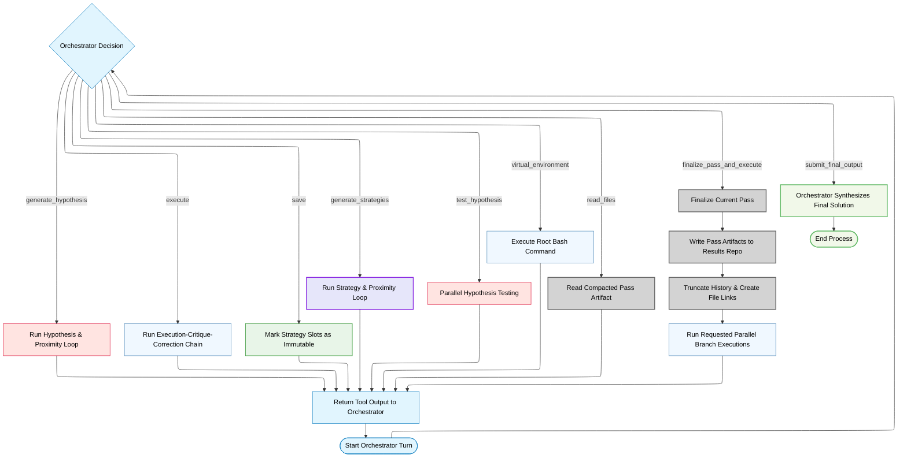

# Adaptive Deepthink Architecture

Adaptive Deepthink is an orchestrator-directed, pass-based strategic search and refinement system. Unlike standard Deepthink's fixed pipeline, Adaptive Deepthink uses an LLM-driven **Orchestrator** running inside a LangGraph `StateGraph` runtime to dynamically coordinate task execution.

The Orchestrator interacts with the environment and a suite of independent, domain-adapted worker agents via structured tool calls. It decides when to generate strategic options, formulate hypotheses, test assumptions, execute parallel solution branches, save promising results, and perform final synthesis.

---

## Architectural Principles


### Core tricks
Strategies & Hypothesis goes back and forth with their proximity agents before finalizing their output vectors and this autonomously refines their quality and divergence. Second, Unlike Deepthink,  hypothesis here are critique driven only. Nextly, when the strategy is iterated (i.e. sent to another pass) then it means by definition it's correction was flawed i.e. it didn't fully bend / steer according to the critique., and thus for the next iteration we literally continue from the previous execution and critique, with revised hypothesis (based on critique) and now call the execution > critique and correction loop., now again from this loop the orchestrator reads the critique > correction output and see how flexible the corrrection output was and based on that decide to save / iterate on that.

### Orchestrator-Centric Delegation
Adaptive Deepthink does not rely on a hardcoded sequence of agent activations. The Orchestrator acts as the central strategic decision-maker, evaluating returned results (observations) and invoking tools to delegate sub-tasks. There is no automated final judge agent; the Orchestrator evaluates candidate solutions and submits the definitive response directly.

### Bounded Adversarial Workers
Worker agents are organized in adversarial generator-critic pairs to prevent premature convergence:
- **Strategy Generation**: A Strategy Generator and a Strategies Proximity agent run a bounded three-round feedback loop to explore diverse problem-solving strategies.
- **Hypothesis Generation**: A Hypothesis Generator and a Hypothesis Proximity agent run a similar loop to produce orthogonal, falsifiable, critique-driven assertions.

Both pairs share a history buffer during their loop, ensuring the generator cannot ignore the proximity agent's critiques.

### Pass Isolation and Context Compaction
To prevent context window degradation and model confusion over long reasoning sessions, the system operates in discrete **passes**. Completed pass outputs are compacted into Markdown files in the Results repository. The Orchestrator’s raw message history is truncated behind a `compactionBoundary`, replacing verbose agent transcripts with compact file links. The Orchestrator can access past transcripts only by explicitly calling the `read_files` tool.

### Git Checkpoint-Rollback Semantics
For unsaved strategy slots, the orchestrator executes a git-backed snapshot immediately before the Correction agent runs. If the strategy is not saved, its directory is restored to this pre-correction checkpoint prior to any future execution in a subsequent pass. This guarantees that discarded corrections and intermediate file alterations do not pollute the workspace or contaminate subsequent passes.

### Sandbox Root Privileges
When the Sandbox Terminal Environment is enabled, worker agents operate under strict directory scopes (e.g., Execution, Critique, and Testing directories). In contrast, the Orchestrator holds root read/write access to the entire repository view, executed through the `virtual_environment` tool.


---

## Operational Mode Comparison

| Feature | Standard Deepthink Mode | Adaptive Deepthink Mode |
|---|---|---|
| **Control Flow** | Fixed branch-search pipeline | LLM Orchestrator-directed LangGraph state loop |
| **Branch Management** | Hardcoded strategy slot/branch versions | Dynamic saving, replacement, and pass finalization |
| **Final Judge** | Separate, isolated `Final Judge` agent | Main Orchestrator via `submit_final_output` |
| **Context Window** | Maintained throughout execution | Compacted at pass boundaries to minimize token bloat |
| **Hypothesis Generation** | Generated up-front or at fixed intervals | Dynamically triggered by the orchestrator |
| **Sandbox Access** | Scoped worker directories only | Scoped worker directories + Orchestrator root access |

---

## Tool System Matrix

The Orchestrator directs execution by calling exactly one of the following tools per graph turn:

| Tool Name | Zod Schema | Description | Downstream Behavior |
|---|---|---|---|
| `generate_strategies` | `count: 1-5`<br>`proximityLoops?: 1-5` (default `2`)<br>`specialContext?: string`<br>`replaceStrategyIds?: string[]` | Generates or updates up to five strategies in slots `S1` to `S5`. `proximityLoops` steers how diverse the strategies should be by controlling the number of proximity revision rounds. | Replaces unsaved strategies. Replaced strategy slots are cleared, while saved slots remain untouched. |
| `generate_hypothesis` | `count: 1-5`<br>`proximityLoops?: 1-5` (default `2`)<br>`specialContext?: string` | Creates critique-driven, independent hypotheses. `proximityLoops` steers how diverse the hypotheses should be by controlling the number of proximity revision rounds. | Deletes all previous hypotheses and test records, starting a clean testing iteration. |
| `test_hypothesis` | `hypothesisIds: string[]` | Evaluates selected hypotheses in parallel using isolated Hypothesis Testers. | Updates the active tested hypothesis list with `VALIDATED`, `REFUTED`, or `INCONCLUSIVE` classifications. |
| `execute` | `executions: ExecRequest[]`<br>`specialContext?: string` | Executes selected strategies in parallel through the Execution → Critique → Correction chain. | Records execution records, critiques, and corrected solutions for the active pass. |
| `save` | `strategyIds: string[]` | Permanently saves selected strategies and their currently corrected branch state. | Marks slots as saved/immutable. Saved slots cannot be executed, updated, or replaced again. |
| `finalize_pass_and_execute` | `executions: ExecRequest[]`<br>`specialContext?: string` | Finalizes the active pass, compacts outputs to files, advances `passNumber`, and executes new branches. | Commits files, shifts the `compactionBoundary` in history, and triggers the next executions. |
| `read_files` | `paths: string[]` | Retrieves the contents of compacted pass files. | Returns the file contents directly in the tool result block. |
| `virtual_environment` | `command: string`<br>`timeoutMs?: number` | Executes a bash command in the repository virtual environment with root privileges. | Returns exit code, stdout, stderr, and execution duration. |
| `submit_final_output` | `response: string` | Submits the final, synthesized solution to the user, concluding the run. | Sets graph state `shouldExit` to `true` and terminates the orchestrator loop. |

---

## Agent Context Contracts

Worker agents receive restricted context blocks generated dynamically by the orchestrator core. Verbose tool execution transcripts are hidden from downstream agents.

### Strategy Generator
- **Receives**: Core Challenge, original image (if any), target count, and optional orchestrator `specialContext`.
- **Withholds**: Hypotheses, past solutions, critiques, or corrections.
- **Output**: JSON strategy array.

### Strategies Proximity Agent
- **Receives**: Core Challenge, candidate strategy list, revision history, and optional `specialContext`.
- **Withholds**: Solution attempts, critiques, or test results.
- **Output**: Proximity review detailing overlaps and structural gaps.

### Hypothesis Generator
- **Receives**: Core Challenge, target count, recent `{Execution + Critique}` blocks from the current pass, and optional `specialContext`.
- **Withholds**: Corrector outputs, strategy texts, prior hypothesis packets, or resolved knowledge packets.
- **Output**: JSON hypothesis array.

### Hypothesis Proximity Agent
- **Receives**: Core Challenge, candidate hypothesis list, revision history, and optional `specialContext`.
- **Withholds**: Strategy details or solution attempts.
- **Output**: Proximity review ensuring orthogonality and falsifiability.

### Hypothesis Tester
- **Receives**: Core Challenge, original image (if any), and exactly one hypothesis.
- **Withholds**: Strategies, other hypotheses, critiques, or execution history.
- **Output**: Detailed validation/refutation report and classification.

### Execution Agent
- **Receives**: Core Challenge, original image (if any), assigned strategy, mapped tested hypotheses, previous pass execution-critique (if any), and branch special instructions.
- **Withholds**: Peer execution records, critiques, or corrections.
- **Output**: Full initial solution attempt.

### Critique Agent
- **Receives**: Core Challenge, original image (if any), assigned strategy, and the current pass initial solution attempt.
- **Withholds**: Hypotheses, corrections, or special instructions.
- **Output**: Diagnostic critique focusing on flaws and missing constraints.

### Corrector Agent
- **Receives**: Core Challenge, original image (if any), assigned strategy, initial solution attempt, and the critique.
- **Withholds**: Hypotheses, other strategies, or previous corrections.
- **Output**: Corrected solution attempt.

---

## Sandbox Virtual Environment & Directory Layout

Worker agents execute in temporary sandboxes. The directories they can view are scoped dynamically.

### Sandbox Roles and Scopes

| Agent / Sandbox Role | Sandbox Role ID | Writable Directory | Readable Directories & Scope |
|---|---|---|---|
| **Orchestrator** | N/A | None (Uses VFS root) | **Full Repository Access** (`fullRepositoryRead: true`, `fullRepositoryWrite: true`) |
| **Strategy Generator** | `Main Strategy Generation` | `/tmp` (Private scratch) | **Full active-repository read** (excluding pruned strategies) |
| **Strategies Proximity** | `Main Strategy Generation` | `/tmp` (Private scratch) | **Full active-repository read** (excluding pruned strategies) |
| **Hypothesis Generator** | `Hypothesis Generation` | `/tmp` (Private scratch) | **Full active-repository read** (excluding pruned strategies) |
| **Hypothesis Proximity** | `Hypothesis Generation` | `/tmp` (Private scratch) | **Full active-repository read** (excluding pruned strategies) |
| **Hypothesis Tester** | `Hypothesis Testing` | `Hypothesis-v{passNumber}/Hypothesis-{id}` | Scoped to own test directory. Prior testing rounds are read-only. |
| **Execution Agent** | `Solution Attempt` | `Strategy-{N}` | Scoped to own strategy directory. Mapped hypothesis test directories are read-only. |
| **Critique Agent** | `Solution Critique` | `Strategy-{N}/Critique` | Read-only access to parent `Strategy-{N}` files. Mapped hypothesis test directories are read-only. |
| **Corrector Agent** | `Solution Correction` | `Strategy-{N}` | Read-only access to own `Critique` subdirectory. Peer strategies are read-only. |

### Sandbox Workspace Directory Structure

Within the sandbox virtual environment, `/workspace` exposes the following layout:

```text
/workspace/
├── direct_context/             [Mount: Read-Only] Challenge files and seeded images
├── user_uploaded/              [Mount: Read-Only] Files uploaded directly by the user
├── Strategy-{N}/               [Mount: Read-Write for Execution/Correction, Read-Only for Critique]
│   ├── .tmp/                   Private scratch space for Strategy-{N}
│   ├── Critique/               [Read-Write for Critique; Read-Only for Corrector]
│   └── <source files>          Scripts, source code, and tests generated by the branch
└── Hypothesis-v{pass}/
    └── Hypothesis-{id}/        [Read-Write for Hypothesis Tester; Read-Only for workers]
```

---

## Pass Lifecycle and Compaction

Adaptive Deepthink maintains strategic memory across multiple iterations without token overflow by employing a strict pass finalization workflow:



### Compaction Details
When `finalize_pass_and_execute` is called:
1. All agent responses and JSON logs generated in `Pass-N` are written to files named `Pass-{N}-{StrategyId}-{Role}.md` (and their trace equivalents) inside `/workspace/Results`.
2. The orchestrator's history state `compactionBoundary` is updated to the index of the finalization message.
3. On the subsequent agent turn, LangGraph constructs the orchestrator's prompt by slicing history from the `compactionBoundary` forward. This drops the heavy raw text of prior execution turns, substituting a summary list of compacted files.

---

## UI Surface Integration

Adaptive Deepthink maps its state transitions to the shared Deepthink UI, making the workspace consistent:

| Tab | Purpose in Adaptive Mode | Condition |
|---|---|---|
| **Live** | Displays real-time orchestrator decisions, thought segments, tool calls, and execution logs. | Always visible. |
| **Strategic Solver** | Shows active strategies, execution attempts, critiques, corrections, and saved states. | Always visible. |
| **Hypothesis Explorer** | Displays the current round of hypotheses, test details, and validations. | Appears when `hypotheses` exist. |
| **Final Result** | Displays the final answer submitted by the orchestrator. | Appears upon completion. |

In addition, the **Agent Activity** side panel streams every orchestrator decision, tool input, and execution state.
