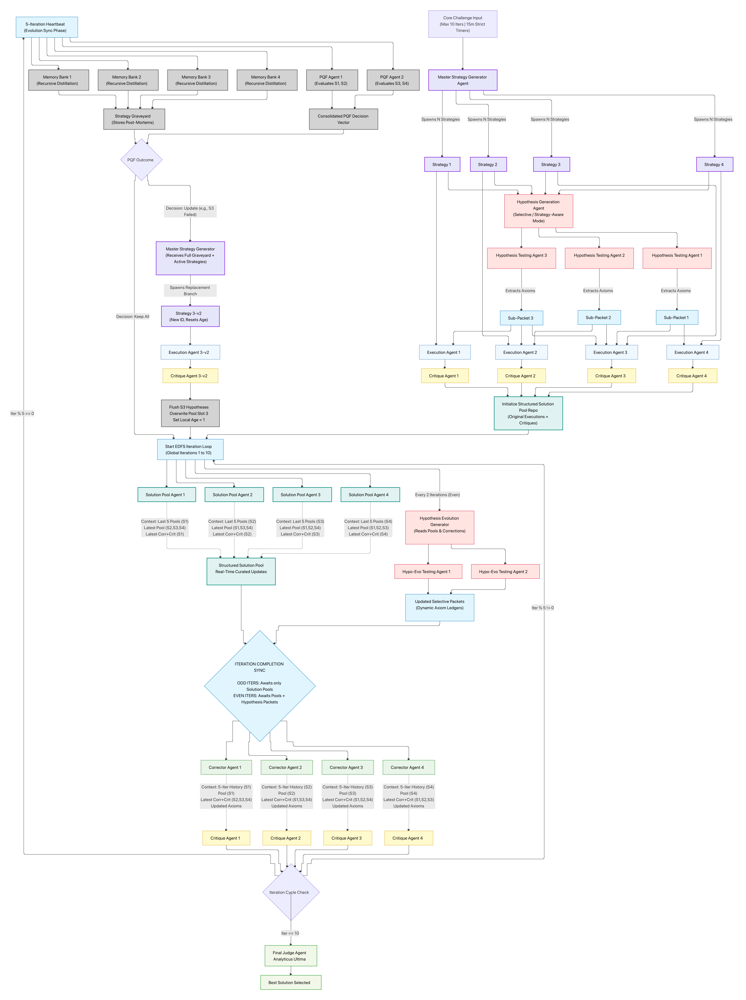

# Iterative Studio

Highly specific & carefully thought multi-agent pipelines. The goal is to scale the inference test-time compute for any kind of problem/benchmark and push the frontier.

## Operational Modes

The system operates in three distinct modes, each optimized for specific use cases.


### 1. Deepthink Mode (huge refactoring in progress)

**Purpose**: High-depth problem solving through independent strategic branches, targeted hypothesis testing, parallel execution, critique, correction, and explicit final selection.

Deepthink supports two execution families:

1. **Single-pass strategic search**: Generates up to ten main strategies, optionally expands each into sub-strategies, tests hypotheses, executes all branches, and optionally performs critique synthesis, full-solution context correction, or both.
2. **Evolving Depth First Search**: Runs up to five direct strategy branches through repeated correction and critique. Each branch has a structured breadth-first solution pool, recursive memory bank, selective hypothesis packet, and periodic Post Quality Filter evaluation.

In Evolving DFS, the original execution is iteration 1. Subsequent iterations correct and critique the active solution, refresh strategy-specific hypotheses every two global iterations, and run memory/PQF maintenance after each branch accumulates five new history entries. PQF can keep a branch or replace its strategy in the same stable slot with a clean, versioned branch.

The Structured Solution Pool is the BFS companion to the depth-first correction loop. It creates five substantively executed alternatives per strategy and iteration, while correctors receive deep local history and only limited cross-strategy context. Replaced branches remain archived for inspection but are excluded from active prompts and final judging.

Hypothesis routing supports Blind Trust, Strategy-Aware, and Selective modes. Evolving DFS always uses Selective mode and injects each strategy's tested packet into its execution, correction, and solution-pool agents.

The Final Judge sees only active candidate solution texts. It does not receive critiques, memory banks, solution pools, PQF decisions, or replaced branches.

**Sandbox Environment and Artifact Submission**:
Deepthink integrates a secure sandbox virtual environment for execution and verification.
- **Repository Visibility**: Every Deepthink role receives `sandbox_exec` and `final_output` when the Sandbox Terminal Environment is enabled. Active branches use `Strategy-N/{Critique,SolutionPool}`: execution and correction write direct branch files, critique owns `Critique`, and the pool owns `SolutionPool`. PQF replacements archive the complete old branch under `Pruned_Strategies/Strategy-N_First_PQF` (then ordinal successors) before recreating fresh active slot directories. Hypothesis tests are organized by `Hypothesis-vN`, while only current selectively routed tests are mounted to branch workers.
- **Submit Final Artifact**: Sandbox-enabled agents use `sandbox_exec` for iterative exploration and testing, then use `final_output` to submit their completed work. JSON-producing roles submit their existing role-specific JSON object directly through `final_output`; the environment validates that contract in the tool loop and returns a correction error without discarding the agent's research. Downstream agents and the central system receive only the submitted artifact, filtering out intermediate command transcripts and scratchpad data.



See [Deepthink architecture and context flow](Deepthink/DeepthinkDocs.md) for the complete agent contracts, repository schemas, mode behavior, iteration synchronization, and failure policy. The previous diagram remains archived at `Deepthink/OldSystemArchitecture.png`.


### 2. Adaptive Deepthink Mode

**Purpose**: An orchestrator-directed, pass-based Deepthink workflow for divergent strategic search without a separate final judge.

**Worker topology**:
- Strategy Generator ↔ Strategies Proximity
- Hypothesis Generator ↔ Hypothesis Proximity
- Test Hypothesis
- Execution → Critique → Correction for each selected strategy

Each generation/proximity pair runs a bounded three-round internal revision loop. The orchestrator remains responsible for judging evidence, selectively routing tested hypotheses, saving successful strategies, replacing failed unsaved slots, and submitting the final answer.

**Tool system**:
- `generate_strategies` — generates or updates up to five unsaved strategies.
- `generate_hypothesis` and `test_hypothesis` — create critique-driven, non-strategy-aware hypotheses and test them independently.
- `execute` — parallel per-strategy Execution → Critique → Correction, with optional per-branch `specialContext`.
- `save` — permanently reserves a strategy and its corrected branch state.
- `finalize_pass_and_execute` — compacts the completed pass into Markdown/trace files, advances the pass, then executes the requested next branches.
- `read_files`, `virtual_environment`, and `submit_final_output` — restore compacted evidence, use the shared sandbox repository, and let the orchestrator submit the final answer.

**Filesystem and UI**:
Adaptive runs project directly into the Deepthink Live and Filesystem tabs. When the Sandbox Terminal Environment is enabled, every worker receives the corresponding Deepthink role permissions and `final_output`; the orchestrator receives an explicit root read/write virtual-environment tool. Full agent outputs and JSON traces are written to the Results repository. Before an unsaved branch's correction runs, its strategy directory is checkpointed; the checkpoint is restored before a later pass reuses that strategy, so discarded corrections cannot leak into future executions.


### 3. Contextual Mode

**Purpose**: Iterative refinement through specialized agent collaboration.

This can work stable upto 2 Hours without human intervention for difficult problems and actually yield high quality insights and results.

**Architecture**:
- Three-agent system with distinct responsibilities:
  1. **Main Generator**: Produces content based on user requirements
  2. **Iterative Agent**: Suggests improvements and corrections
  3. **Memory Agent**: Works like a long term memory.

**Key Components**:
- `ContextualCore.ts`: State management and history tracking
- Separate history managers for each agent type
- Automated context window management

**Agent Interaction**:
```
User Request → Main Generator → Generated Content
                      ↓
              Iterative Agent → Suggestions
                      ↓
              Main Generator → Refined Content
                      ↓
              [Repeat until complete]
                      ↓
              Memory Agent → History Compression
```

**Key Features**:
- Automatic history condensation when context limits approached
- Iterative refinement through suggestion-response cycles
- Clean separation of concerns between agents
- Real-time visualization of agent interactions

**Workflow**:
1. Main generator creates initial content
2. Iterative agent analyzes and suggests improvements
3. Main generator applies suggestions
4. Memory agent compresses history when needed
5. Cycle continues until completion criteria met


## Configuration

### Model Selection

Supports configuration of:
- AI provider (Google, OpenAI, Anthropic)
- Model selection per provider
- Temperature and Top-P sampling parameters
- Mode-specific parameters (iteration depth, agent counts)
- Local Models


###  Fully Offline Mode:
Use your lookback IP: http://127.0.0.1:1234 or http://localhost:1234 when you turn off your wifi or unplug the ethernet cable.

### Mode-Specific Settings

**Deepthink**:
- Strategy and sub-strategy counts
- Hypothesis count and injection mode
- Single-pass refinement, critique synthesis, and full-solution context
- Evolving DFS depth
- PQF aggressiveness
- Optional sandbox terminal execution for every Deepthink agent

**Adaptive Deepthink**:
- Agent-directed access to Deepthink tools and model settings


## License

Apache-2.0
